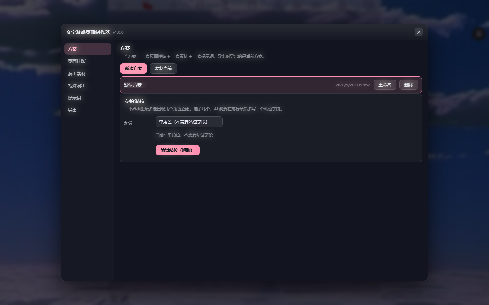
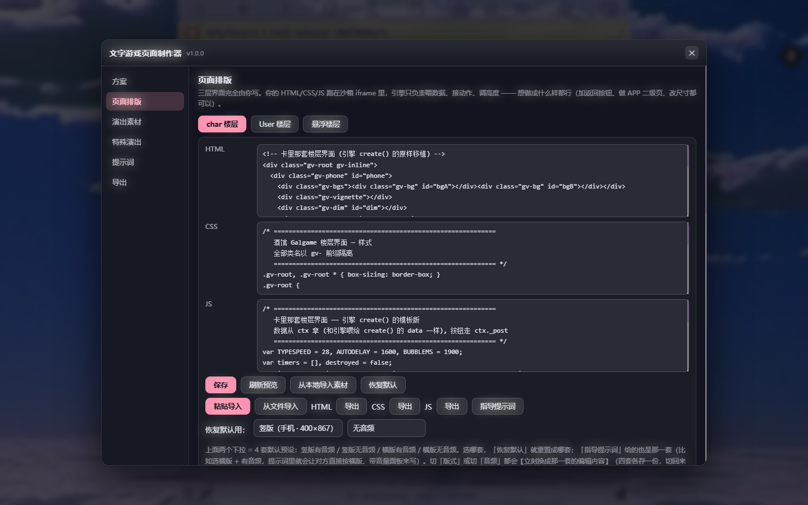
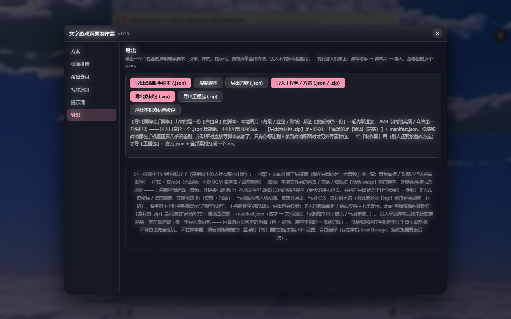
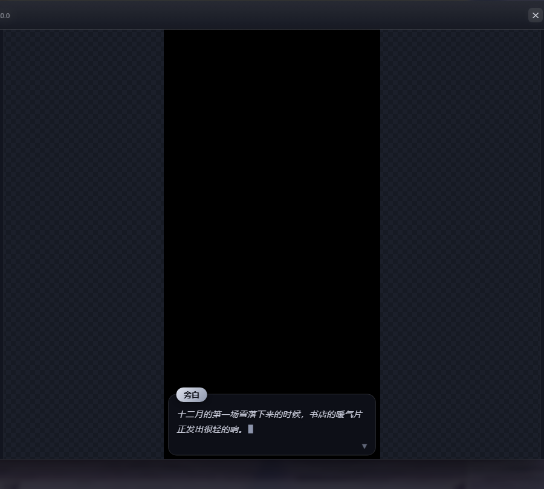

# 文字游戏页面制作器 · TextGameMaker

> **本插件由 DeepSeek V4.1 Flash 完成，这份 README 也由 DeepSeek V4.1 Flash 编写。**
> （从引擎、三层页面模板、素材管线，到真机调试与这份文档，都是它一行行写出来、一条条测出来的。）

一个给 **SillyTavern（酒馆）** 用的「文字游戏页面制作器」扩展：把 AI 写的小说/对话楼层，变成**手机框里能点点点的 Galgame 界面**——
背景分层淡入、立绘带取景与表情、打字机对话框、情绪气泡、音量面板、BGM/音效按行切换，楼层里还能就地编辑。

插件本体提供**可视化制作**：导入素材（背景 / 立绘 / 贴纸 / 音频）、排版三层界面（角色楼层 / 玩家楼层 / 悬浮窗）、
写提示词，最后一键**导出成一份自包含的「酒馆助手脚本」**——别人只拿这一个 .json 就能跑，不装插件也行。

> **第一次用？先看 [大傻子教程](教程.md)** —— 从装插件到把作品发给朋友，一步一步照点就行。

**许可：** [CC BY-NC-SA 4.0](LICENSE) —— 自由使用 / 修改 / 再分发，但**不得用于商业用途**，且衍生作品需以同一协议发布。

---

## 截图

| 方案 / 立绘站位 | 页面排版（三层模板编辑器） | 导出 |
|---|---|---|
|  |  |  |

插件里的实时预览（虚拟楼层，所见即所得 —— 真机跑出来就是这一套）：



---

## 安装

### 1) 装插件（酒馆里直接装）

酒馆 → **扩展（Extensions）** → **安装扩展（Install extension）** → 把本仓库地址粘进去 → 安装：

```
https://github.com/Seck981/textgame-maker
```

装好后刷新页面，顶部工具栏最右边会多出一个**场记板图标**（和酒馆其它图标同一排、同一种颜色，会跟着你的主题/美化走）。
点它就能打开制作器。

> 手动安装也行：把仓库整个 clone 到 `SillyTavern/data/<你的用户目录>/extensions/textgame-maker/`（文件夹名随意），刷新即可。

### 更新

酒馆 → 扩展 → 找到本扩展 → 点它右边的 **更新 / Update**（老版本没有这个按钮就删掉重装，重装不会动你的方案数据）。
更新完 **刷新页面**（F5）。插件里的方案、素材、提示词都存在酒馆的扩展设置里，更新不会丢。

**更新时顺手把 `engine/` 再复制一次**：引擎放在 `public/galgame/` 里，扩展更新**不会**动它，而预览和导出读的就是那一份。
旧引擎导出来的脚本，别人装上去悬浮窗会退回旧样子。所以更新完，照着下面第 2 步再放一次引擎文件（或者跑 `tools/install-engine.mjs`）。
「导出」页会自己检查：引擎是旧版时，页面上会直接给你一条红字提示。

### 2) 放引擎文件（**必做**，否则预览和导出会读不到引擎）

插件在**预览**和**导出**时，会去酒馆的 `public/galgame/` 目录读引擎文件。所以把仓库里 `engine/` 的内容复制到：

```
SillyTavern/public/galgame/
```

复制完应该是这样（`public/galgame/` 下多出这些）：

```
galgame.js          galgame-script.js     galgame.css      galgame-panel.css
fa-inline.css       libs/{animate.css, highlight.css, highlight.js, mermaid.js, tailwind-cdn.js}
```

一键脚本（会自动建目录并复制）：

```bash
ST_DIR=/path/to/SillyTavern node tools/install-engine.mjs
# Windows 例子: set ST_DIR=D:\SillyTavern\SillyTavern && node tools\install-engine.mjs
```

> 为什么必须放：导出的脚本里，引擎是**导出那一刻从 `/galgame/` 现读**并内联进去的；插件的预览 iframe 也读同一个目录。
> 少了它，导出会报「读取失败 /galgame/galgame.js」。

### 3) 想要「真机」跑起来，再装一个扩展

导出的产物是**酒馆助手（JS-Slash-Runner）脚本**。要让它在聊天里跑，需要先装这个扩展：

- **JS-Slash-Runner（酒馆助手）** —— 酒馆 → 扩展 → 安装扩展，粘它的仓库地址即可。
- 装好后：酒馆助手 → 脚本库 → 导入 → 选你导出的 `xxx.酒馆助手脚本.json` → 绑定到角色卡。

**依赖汇总**

| 依赖 | 需要吗 | 说明 |
|---|---|---|
| SillyTavern | **≥ 1.12.0** | 插件本体只需要酒馆；`manifest.json` 里写的最低版本就是 1.12.0 |
| 引擎文件放 `public/galgame/` | **必须** | 见上面第 2 步 |
| JS-Slash-Runner（酒馆助手） | 想在聊天里跑就要 | 插件本身不依赖它；**导出的脚本**是它的格式 |
| 其它扩展 | 不需要 | 无 |

---

## 怎么用（5 步）

1. **打开制作器**（顶部场记板图标）→ 「方案」页新建一个方案（方案 = 一套模板 + 一套素材 + 一套提示词）。
2. **「演出素材」页**导入背景 / 立绘（可以「取景」拖位置和缩放）/ 贴纸 / BGM / 音效；图床链接也行。
3. **「页面排版」页**调三层界面：
   - `char 楼层`：角色说话那一层（手机框 + 立绘 + 对话框 + 气泡 + 音量面板）；
   - `User 楼层`：玩家那一层；
   - `悬浮楼层`：楼层「正文之外那一大坨」的浮窗（列表 / 编辑 / 导入素材包）。
   每一层都可以直接在插件里改 HTML / CSS / JS，或者点「指导提示词」把提示词整份发给别的 AI，让它照着改（回来点「粘贴导入」，三段代码会自动分进三个框）。
4. **「提示词」页**看一眼发给 AI 的格式说明（楼层里怎么写 `旁白||…`、`角色|表情|台词`、`【bg:xxx】`、`【bgm:xxx】`）。
5. **「导出」页**点「导出酒馆助手脚本」，把 .json 导进酒馆助手、绑定角色卡 —— 完事。

### 导出里到底打包了什么

- **引擎 + 三层页面模板 + 样式 + 提示词**：全部内联，拿到脚本的人什么都不用装。
- **图像**：本地文件类的背景 / 立绘 / 贴纸会**按低清烘一份**（webp）内联进脚本，外链类直接写原地址 —— 只拿脚本就有图。
- **音频**：外链类写原地址；本地文件会**自动压成 Opus**（64kbps，实测一首 9.1 MB 的歌压到 1.81 MB，时长分毫不差）再烘进脚本。
  导出页可以选 64k / 96k / 原样 / 不烘；压缩明细写在导出状态里。
- **参数**：多人站位坐标 / 占位画框、立绘取景（位置 + 缩放）、气泡落点与入场动画、自定义演出、气泡 CSS、按行换背景。
- **素材包 .zip**（可选）：里面是**原图**（高清）+ manifest.json。低清和高清在手机框里几乎看不出差别，所以平时只导脚本就够了；
  想让别人拿到高清原图时才另外导素材包（对方在悬浮窗「素」里导入即可，同名素材以包为准）。

---

## 目录结构

```
textgame-maker/
├─ manifest.json          酒馆扩展清单（仓库根目录必须能直接装）
├─ index.js               插件本体（含烘焙好的三层默认模板 + 三份指导提示词）
├─ style.css              插件界面样式（含手机端自适应）
├─ engine/                引擎：要复制到 <酒馆>/public/galgame/
│  ├─ galgame.js          渲染引擎（楼层界面 / 背景 / 立绘 / 气泡 / 音频 / 悬浮窗画布）
│  ├─ galgame-script.js   卡里那一份脚本源（导出时内联进"酒馆助手脚本"）
│  ├─ galgame.css / galgame-panel.css
│  ├─ fa-inline.css       字体图标（离线内联版）
│  └─ libs/               tailwind / highlight.js / mermaid / animate.css（沙箱里直接可用）
├─ templates/             三层页面模板源码 + 构建脚本
│  ├─ tpl/{char,user,panel}.{html,css,js} · char-land.css
│  ├─ bake-tpl.mjs        把 tpl/ 烘焙进插件 index.js（改模板后跑这个）
│  ├─ bake-prompts.mjs    把指导提示词烘焙进插件
│  ├─ mk-page-prompts.mjs 生成三份指导提示词（含默认模板全文）
│  ├─ tpl-css.mjs         从引擎 CSS 同步样式到模板
│  ├─ sync-rich.mjs       把引擎里的富渲染段同步进插件预览（改了那段就重跑）
│  └─ pngcard.mjs         读写角色卡 PNG（chara / ccv3 两份元数据）
├─ tools/                 维护脚本（可选）
│  ├─ install-engine.mjs  把 engine/ 复制到 <酒馆>/public/galgame/
│  ├─ mk-fa-inline.mjs    生成 fa-inline.css
│  ├─ mk-libs.mjs         下载 libs/（tailwind、highlight、mermaid、animate）
│  └─ mk-tailwind.mjs
├─ docs/                  设计与需求文档、截图
├─ README.md
└─ LICENSE (CC BY-NC-SA 4.0)
```

### 改模板 / 二次开发

```bash
# 改完 templates/tpl/* 之后，把模板烘焙进插件（会直接改 <酒馆>/data/<用户>/extensions/textgame-maker/index.js）
ST_DIR=/path/to/SillyTavern node templates/bake-tpl.mjs

# 改完 mk-page-prompts.mjs 里的提示词之后
ST_DIR=/path/to/SillyTavern node templates/bake-prompts.mjs
```

`ST_DIR` 指向你的酒馆根目录（里面能看到 `public/` 和 `data/`）。不设的话脚本会用占位路径，跑之前请务必设对。

---

## 几个实测踩过的坑（用的时候能省很多时间）

1. **导入脚本后还是老效果？** 先把**其它还开着酒馆的标签页关掉/刷新**——酒馆前端会把整张角色卡放在页面内存里，
   任何一个旧标签页保存角色，都会把内存里的旧卡（连同旧脚本）写回磁盘。这也是"我明明换了脚本怎么还是旧的"的头号原因。
2. **背景/立绘名字对不上**：楼层正文里写的 `【bg:名字】`、`角色|表情` 必须在方案里存在同名素材。
   对不上时**不会乱挑一张顶替**，会明确提示「脚本自带素材里没有（现有：…）」。
3. **换过素材还是显示旧的**：悬浮窗 →「素」→「清除浏览器素材包缓存」再刷新（素材包缓存在浏览器 IndexedDB 里，清"缓存"清不掉它）。
4. **按行换背景**：消息里多处 `【bg:xxx】` 会跟着演到那一行切换；`【bg:xxx】` 要**整行**写。
5. **单人模式**：站位 ≤ 1 时一律居中（站位/画框字段不参与），预览和真机是同一套规则。

---

## 许可

**CC BY-NC-SA 4.0**（署名—非商业性使用—相同方式共享 4.0 国际）—— 法律文本见 [LICENSE](LICENSE)。

- **可以**：随便用、随便改、随便发给别人，改完也能再发；
- **必须**：
  1. **署名** —— 注明来自本仓库（`github.com/Seck981/textgame-maker`）并标明是否修改过；
  2. **非商业性使用** —— 不得用于商业目的（不许卖、不许付费分发、不许内置进商业产品）；
  3. **相同方式共享** —— 你改完 / 再混合的版本，也必须用 CC BY-NC-SA 4.0 发布。

> 一句话：这是免费给大家玩的东西，**别拿它赚钱**。

**你导出的那份脚本也在这个许可之下**：导出的 `.json` 里内联了本仓库的引擎、三层模板和样式，
所以它同样属于「本作品」：可以随便发给别人玩、随便改，但同样**不得商用**。

第三方库（`engine/libs/`、`engine/fa-inline.css`）分别是 Tailwind CSS、highlight.js、Mermaid、animate.css、Font Awesome Free，
各自遵循其原许可（均为 MIT 或同类宽松许可），版权归各自作者所有；这部分不受上面「非商业」条款的额外限制。

其余说明（署名怎么写、第三方库）见仓库里的 [NOTICE](NOTICE)。

---

© 2026 TextGameMaker · 本作品采用 [CC BY-NC-SA 4.0](LICENSE) 许可协议 · 版本：**v1.0.4**

**v1.0.4 改了什么**：取景 / 定位弹窗（气泡位置、立绘取景、立绘站位）整体缩小并按屏幕高度自适应 ——
以前固定 840px 宽、框最高 520px，在 720 高的屏幕上会顶出视口、底下的按钮点不到；现在弹窗 660 宽、框按可用高度算，
并且加了「弹窗不超过视口 + 内容区自己滚动」的兜底。

**v1.0.3 改了什么**：气泡可以**按站位分别调**了 —— 多人站位时「特殊演出 → C · 气泡位置 / 大小」上面多一排「调整哪个站位」，
每个站位各有一套落点（进去默认先调第一个站位那一套），拖的时候垫底的立绘也会站在你正在调的那个站位上。
优先顺序：单个气泡单独调的 > 这个站位单独调的 > 默认。真机和插件预览同一套规则（实测：左 20%/12%，右 80%/45%/1.4×，没写站位的行走默认 50%/20%）。

**v1.0.2 改了什么**：本地音频现在会**自动压成 Opus 再烘进脚本**（浏览器里的 WebCodecs 编码器 + 自己封 Ogg，
实测一首 9.1 MB 的歌压成 1.81 MB，时长 234.6 秒分毫不差）—— 别人拿到脚本就有音乐，不用再让他导素材包。
导出页新增「本地音频」四档：Opus 64k（推荐）/ Opus 96k / 原样烘 / 不烘；导出状态里会写明每首压缩前后的体积。
顺手修好两件事：悬浮窗「词」里看不到格式提示词（显示用的那份数据没传给面板）、找不到音频时进度条静默 0:00。

**v1.0.1 改了什么**：修好悬浮窗里 ```html 围栏不渲染的老问题 —— 以前围栏里的卡片会把三个反引号原样显示出来、
卡片里的脚本也不执行（所以那些该点开的摘要卡点不动）。现在围栏里的内容跑在它自己的小页面里，和酒馆楼层的表现一致；
插件预览的悬浮楼层也换成同一套渲染。**这次更新记得重放一次 engine/**（见上面「更新」）。
